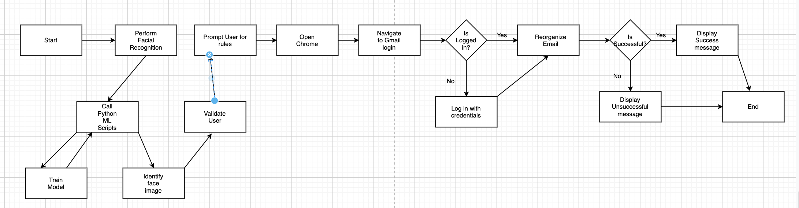

# Jewlz-TheBoyz-EmailCategorizationBot-P2

# Introduction
For our P2, we have decided to make an automation in UI Path Studio based off of one of the suggestions in the RevaturePro Slides. We will be making a Email Categorization Bot.

# Automation
This bot will automatically sort and categorize the users emails by a certain set of rules. We plan on adding facial recogniztion, the ability to login to different email services, and anything else we have time for.

# Flow Chart

  

# Tech Stack
Phase 1:
-Gmail
-UI Path Studio

Phase 2:
-Python/Flask
-OpenCV
-MS Outlook

# Phase 1
Implement Robot to take in user credentials, users preferred organization rules, and navigate to gmail on a web browser. The bot will then sign in that user, navigate the UI elements on gmail and organize emails based on a users rules.

# Phase 2
Implement Phase 1 as defined previously but instead of asking for credentials, the bot will have a “scan” step which makes a call to a python flask site which returns credential information related to that user.

# Audience
Our audience will include:
-Anyone with a gmail account
-Anyone who wants to categorize their emails
