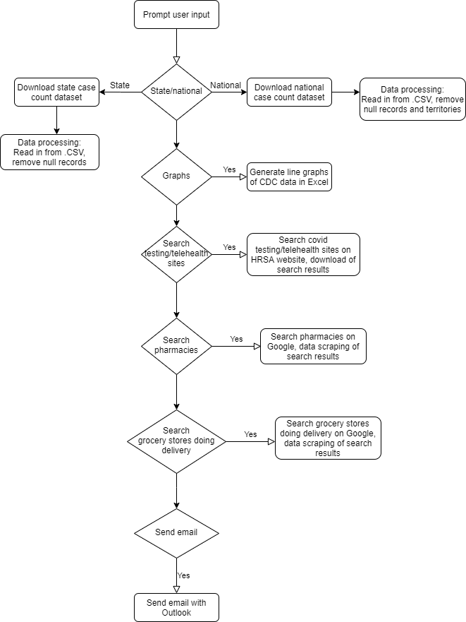

# Life in the Time of Corona

## Description
Our project will pull CDC data on coronavirus case counts by state, generate a graph and present the data to the user, automate searches of testing sites/telehealth centers, grocery stores doing delivery, and pharmacies by zip code, and email the data to the user.

## Automation
1. Prompt user input:
    * State/national data
    * Zip code to search testing sites/telehealth centers, grocery stores doing delivery, pharmacies
    * Graphs
    * Email
2. Download case count data from CDC website
3. Scrape data from downloaded .CSV file
4. Data processing: read in from .CSV, remove null records and territories
5. Generate graphs with Excel
6. Search testing sites/telehealth centers near zip code on HRSA website
7. Search grocery stores near zip code on Google
8. Search pharmacies near zip code on Google
9. Email user with case count data, graphs, predictions, health center locations, grocery stores/pharmacies

## Tech Stack
UiPath
* Excel activities
* Outlook activities
* Data scraping

## Flowchart

## Team Pi
Nicole Holden, James Mann, Angela Li
